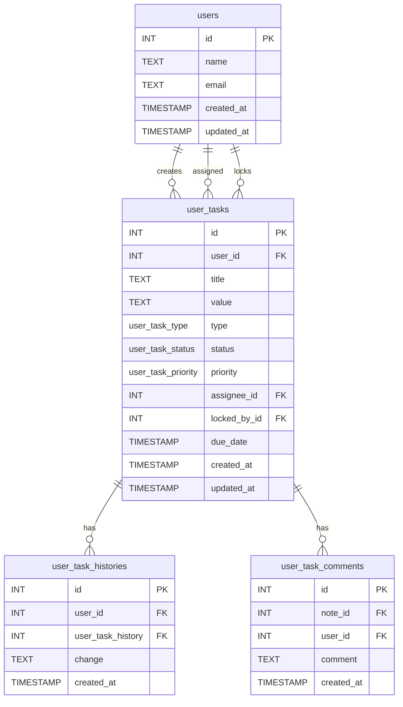

# Database Design

```mermaid
erDiagram
  users {
    INT id PK
    TEXT name
    TEXT email
    TIMESTAMP created_at
    TIMESTAMP updated_at
  }

  user_tasks {
    INT id PK
    INT user_id FK
    TEXT title
    TEXT value
    user_task_type type
    user_task_status status
    user_task_priority priority
    INT assignee_id FK
    INT locked_by_id FK
    TIMESTAMP due_date
    TIMESTAMP created_at
    TIMESTAMP updated_at
  }

  user_task_histories {
    INT id PK
    INT user_id FK
    INT user_task_history FK
    TEXT change
    TIMESTAMP created_at
  }

  user_task_comments {
    INT id PK
    INT note_id FK
    INT user_id FK
    TEXT comment
    TIMESTAMP created_at
  }

  users ||--o{ user_tasks : creates
  users ||--o{ user_tasks : assigned
  users ||--o{ user_tasks : locks
  user_tasks ||--o{ user_task_histories : has
  user_tasks ||--o{ user_task_comments : has
```