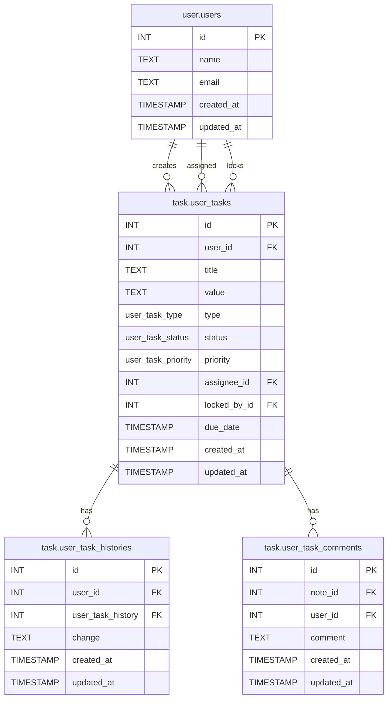

# Database Design

## Setup on postgreSQL

Prerequisites:
•	You must have pgAdmin installed and connected to your PostgreSQL server.
•	You should have appropriate permissions on the database you’re modifying.

Steps to Run the Script in pgAdmin:

1. Open pgAdmin and connect to your database
   - Launch pgAdmin.
   - Connect to your server.
   - Expand the tree view on the left: Servers > [Your Server] > Databases > [Your Database].

2. Open a Query Tool
   - Right-click on the target database (e.g., myapp_db) in the tree view.
   - Select Query Tool from the context menu.

3. Paste the SQL script
   - In the SQL editor that opens, paste the entire script (from the BEGIN; to COMMIT; block).
   - Make sure all of it is copied in one go.

4. Execute the Script
   - Click the Execute/Run button (lightning bolt icon), or press F5.
   - The message pane below should show Query returned successfully if all goes well.

5. Confirm Changes
   - Refresh your Tables list by right-clicking Tables > Refresh to verify new tables were created.
   - Optionally: Go to Views to see locked_tasks_view.
   - You can also expand Functions and Triggers to verify that set_updated_at and all triggers are present.

## Steps for database

1. execute setup.sql
2. execute test-data.sql
3. 